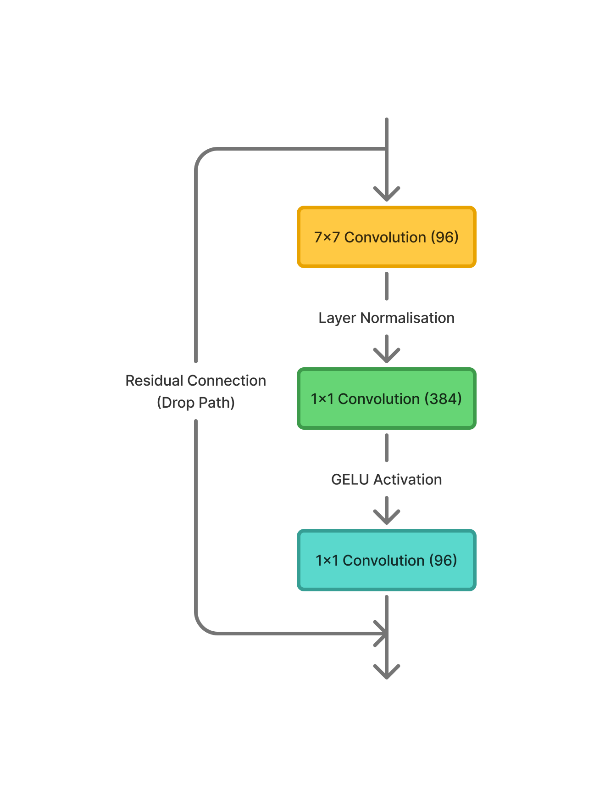

# Classifying Alzheimer's using ConvNeXt

## Introduction

Alzheimer's Disease is a brain disorder that causes deterioration of the brain, resulting in loss of memory and thinking skills (NIA, 2025). A Magnetic Resonance Imaging (MRI) scan uses strong magnet and radio waves to produce images of inside a person's body. There are a number of symptoms that can be visible from an MRI scan to help diagnose Alzheimer's, notably including changes to the hippocampi (Taylor, 2022). As such, it is only logical to attempt to classify these images using deep learning models.

## Architecture

We will explore the use of ConvNeXt, an adaptation of simpler convolutional architecture that incorporates key design ideas from visual transformer models. This approach was heavily inspired by and adapted from "A ConvNet for the 2020s", a paper written by Zhuang Liu et al. Despite this, it will be built from scratch without the use of pretrained weights, and simply attempt to perform binary classification into two classes: Normal Control (NC) and Alzheimer's Disease (AD).

The ConvNeXt architecture uses a selection of convolution, normalisation, and GELU activation layers. The key feature that is typically associated with Transformer architecture is the use of an inverted bottleneck, where a 1x1 convolution layer is used to produce a greater number of output dimensions than input dimensions. This model also makes use of Drop Paths, a concept that drops entire samples from the path to reduce overfitting. If samples are not dropped, they are also passed through blocks as residual connections. Below is a diagram of the structure of a ConvNeXt block:

## Dataset

We will use an MRI dataset available from the Alzheimer's Disease Neuroimaging Initiative (ADNI). This dataset (available on rangpur at `/home/groups/comp3710/ADNI`) has already been split into training and testing sets of 21520 and 9000 image slices respectively. Each patient's MRI scan consists of 20 image slices. If we group these together, the training set contains 1076 patients, and the testing set contains 450. These sets consist of 556 NC and 520 AD images for the training set, and 227 NC and 223 AD images for the testing set. In order to prevent data leakage and improve model performance, slices will be grouped based on the patient ID (assumed to be the first number within the file name). Once these are grouped by patient ID, the training set is split into 914 patients for training, and 162 for model validation.
