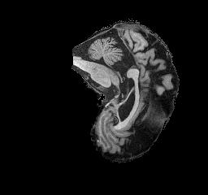
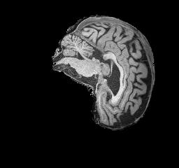

# Classifying Alzheimer's Disease using ConvNeXt

## Introduction

Alzheimer's Disease is a brain disorder that causes deterioration of the brain, resulting in loss of memory and thinking skills (NIA, 2025). A Magnetic Resonance Imaging (MRI) scan uses strong magnet and radio waves to produce images of inside a person's body. There are a number of symptoms that can be visible from an MRI scan to help diagnose Alzheimer's, notably including changes to the hippocampi (Taylor, 2022). As such, it is only logical to attempt to classify these images using deep learning models.

## Architecture

We will explore the use of ConvNeXt, an adaptation of simpler convolutional architecture that incorporates key design ideas from visual transformer models. This approach was heavily inspired by and adapted from "A ConvNet for the 2020s", a paper written by Zhuang Liu et al. Despite this, it will be built from scratch without the use of pretrained weights, and simply attempt to perform binary classification into two classes: Normal Control (NC) and Alzheimer's Disease (AD).

The ConvNeXt architecture uses a selection of convolution, normalisation, and GELU activation layers. The key feature that is typically associated with Transformer architecture is the use of an inverted bottleneck, where a 1x1 convolution layer is used to produce a greater number of output dimensions than input dimensions. This model also makes use of Drop Paths, a concept that drops entire samples from the path to reduce overfitting. If samples are not dropped, they are also passed through blocks as residual connections. Below is a diagram of the structure of a ConvNeXt block:


The implemented model is heavily inspired by the ConvNeXt-T (tiny) model discussed in "A ConvNet for the 2020s". This version of the model has 4 layers with 96, 192, 384 and 768 channels respectively. Similarly, each layer consists of 3, 3, 9 and 3 blocks in that order.

## Dataset

### Data Source

We will use an MRI dataset available from the Alzheimer's Disease Neuroimaging Initiative (ADNI). This dataset (available on rangpur at `/home/groups/comp3710/ADNI`) has already been split into training and testing sets of 21520 and 9000 image slices respectively. Each patient's MRI scan consists of 20 image slices. If we group these together, the training set contains 1076 patients, and the testing set contains 450. These sets consist of 556 NC and 520 AD images for the training set, and 227 NC and 223 AD images for the testing set. In order to prevent data leakage and improve model performance, slices will be grouped based on the patient ID (assumed to be the first number within the file name). Once these are grouped by patient ID, the training set is split into 914 patients for training, and 162 for model validation and to evaluate learning throughout the training process. The decision to split based on patient ID was made to prevent data leakage between the training and validation sets.

### Example Images

Below are two example images from the dataset. The first image represents a single slice from an MRI of a patient with Alzheimer's Disease, while the second represents a slice from a Normal Control patient.





### Data Augmentation

In order to improve generalisation of the model to the test dataset, some augmentation of the dataset takes place in `dataset.py`. By default, image rotations of up to 15 degrees may occur. Images may also be flipped horizontally. In order to address difference in image intensity, brightness and contrast are randomly modified by 0.2. Finally gaussian noise is added to images with a standard deviation of 0.02.

## Setup Instructions

### Prerequisites

- Python 3.13 or greater
- CUDA-capable GPU
- Conda installation

### Installation

#### Step 1: Create Conda Environment

```bash

conda create -n torch python=3.13

conda activate torch

```

#### Step 2: Install PyTorch

```bash

conda install pytorch torchvision pytorch-cuda=11.8 -c pytorch -c nvidia

```

#### Step 3: Install Other Dependencies

```bash

conda install numpy pillow scipy scikit-learn matplotlib seaborn tqdm

```

### File Structure

Your file structure should be laid out as follows:

```bash
    data_dir/
        ├── train/
        │   ├── AD/
        │   │   ├── scan1.jpg
        │   │   └── ...
        │   └── NC/
        │       ├── scan1.jpg
        │       └── ...
        └── test/
            ├── AD/
            │   ├── scan1.jpg
            │   └── ...
            └── NCg
                ├── scan1.jpg
                └── ...
```

Note: On the Rangpur cluster the dataset can be found at `/home/groups/comp3710/ADNI/AD_NC`

### Test Setup

#### Step 1: Test Model Architecture

```bash

python modules.py

```

#### Step 2: Test Data Loader

```bash

python dataset.py --data_dir /path/to/AD_NC

```

## Usage

### Train Alzheimer's Disease Classifier

In order to train the model with the same parameters used in testing, run the following:

```bash

python train.py \
    --data_dir /path/to/AD_NC \
    --batch_size 10 \
    --epochs 100 \
    --lr 1e-4 \
    --scheduler cosine \
    --patience 20 \
    --dropout 0.5 \
    --weight_decay 1e-5

```

This will save the best model and other performance metrics to `checkpoints/run_XXXXXXXX_XXXXXX`

### Predict Using Trained Model

In order to perform prediction using the saved model, run the following:

```bash
python predict.py \
    --model_path checkpoints/run_XXXXXXXX_XXXXXX/best_model.pth \
    --data_dir /path/to/AD_NC \
```

## Analysis of Performance

To evaluate and visualise model performance we will plot the following figures:

1. Accuracy Plot - visualise the training and validation accuracies at each epoch of the training process
2. Confusion Matrix - visualisation of proportion of correct and incorrect classifications
3. ROC Curve - plot of true positive against false positive rate
4. Attention Weight Plots - evaluation of which slices appear to be most informative and discriminative for classfying AD vs NC

These figures can be seen below:

## References

IA. (2025). What Is Alzheimer's Disease? Retrieved October 26, 2025, from National Institute on Aging: https://www.nia.nih.gov/health/alzheimers-and-dementia/what-alzheimers-disease

Taylor, E. (2022). All you need to know about brain scans and dementia. Retrieved October 26, 2025, from Alzheimer's Research UK: https://www.alzheimersresearchuk.org/news/all-you-need-to-know-about-brain-scans-and-dementia/

Zhuang Liu, H. M.-Y. (2022). A ConvNet for the 2020s. Conference on Computer Vision and Pattern Recognition (CVPR) (pp. 11976–11986). IEEE (Institute of Electrical and Electronics Engineers). Retrieved October 15, 2025
